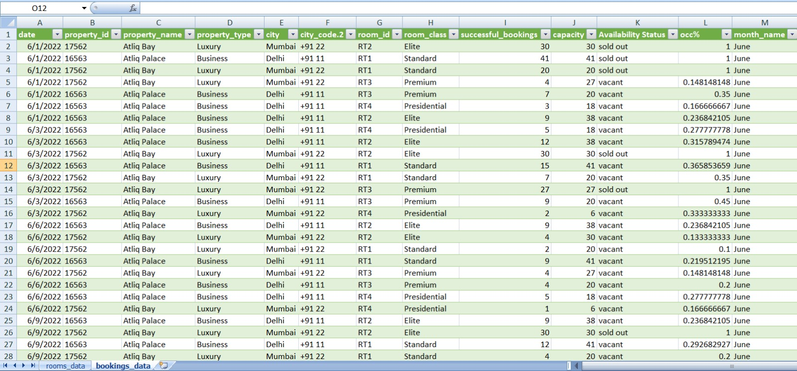

# Hotel-booking-analysis-power-query

Data cleaning and transformation project using Excel Power Query for hotel booking and room dataset

📊 Hotel Booking Data Analysis using Power Query
🔍 Overview

This project focuses on transforming and preparing raw hotel booking and room data using Microsoft Excel Power Query. The primary objective was to clean inconsistent data, standardize formats, and derive meaningful metrics to support operational and business decision-making.

The raw datasets contained multiple issues such as incorrect data types, inconsistent naming conventions, and formatting errors. These were systematically addressed to create a structured and analysis-ready dataset.

📂 Dataset Description
1. Booking Data

Contains booking-related information such as:

Property ID
Booking counts
Capacity
City details
2. Room Data

Includes room-level details such as:

Property type
Room availability
Additional attributes
🛠️ Data Transformation & Cleaning

The following steps were performed using Power Query:

Data Standardization

Converted Property ID from numeric to text format for consistency

Corrected spelling errors and inconsistent categorical values

Removed leading and trailing spaces from text fields

Data Structuring

Split combined columns to extract:

City

City Code

Feature Engineering

Created Availability Status:

Sold Out → when Successful Bookings = Capacity

Vacant → otherwise

Calculated Occupancy Percentage (OCC %) to measure utilization

Data Integration

Merged booking and room datasets for unified analysis

Time-Based Enhancement

Extracted Month and Month Name for time-series insights

📈 Key Outcomes

Improved data quality and consistency

Enabled property-level and city-level performance analysis

Facilitated tracking of occupancy and booking efficiency

Identified availability patterns across properties

⚙️ Tools & Technologies

Microsoft Excel

Power Query

💼 Business Relevance

This project simulates a real-world business scenario in the hospitality sector where raw operational data must be cleaned and transformed before analysis. The processed dataset can be used to:

Monitor occupancy rates

Optimize pricing strategies

Improve inventory utilization

Support data-driven decision-making

🚀 Key Learnings

Importance of data cleaning in analytics workflows

Practical application of Power Query for ETL (Extract, Transform, Load)

Handling real-world messy datasets

Building structured and scalable data models

📌 Future Enhancements

Build an interactive dashboard using Power BI

Automate data refresh and transformation workflows

Perform deeper analysis on trends and seasonality

## ⚠️ Note
This project uses simulated data for learning purposes.

